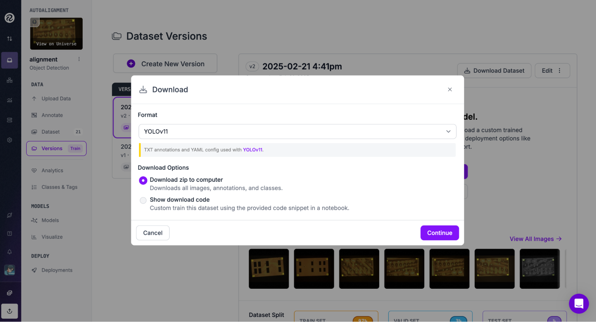

# Finetuning a YOLO Model

This is a guide to training a YOLO model for alignment marker detection, using Roboflow and Ultralytics.

## Dataset

To train a model, we first need a dataset of images of chips.

The GUI has an `auto_snapshot_on_uv` feature, which allows for automatically taking pictures of the stage when switching from red to uv mode. In practice, this will allow for the collection of many images of chips as they are being patterned and reduces the need for manual data collection outside of normal stepper use. It is recommended to manually check these images for quality and filter them before proceeding.

After selecting a collection of images, we need to annotate our data with labels, which store the positions of the alignment markers. These will be used as feedback when training the model. There are many services that can be used to do data annotation. In our case, we'll be using Roboflow, which is a cloud-based computer vision service.

### Dataset Instructions

First, navigate to [app.roboflow.com](app.roboflow.com) and create or sign in to an account.

Then you will be able to see all your projects. Create a new project.


If our data is not size (640, 640), we’ll eventually want to resize it to be since that’s the dimension of input that the YOLO model takes. Roboflow can do this for us, but we also have a script for to doing this ourselves, located [here](https://github.com/hacker-fab/stepper/blob/auto-align/litho/resize.py) on GitHub.

After creating a project, upload the image data that will be used for the dataset.


Once the data is uploaded, it’s time to annotate!

In the annotation tab, you will be able to label bounding boxes on the image with the mouse. In our case, since we’re only looking for alignment markers, we only need to create one label class. We name this “alignment-markers” but any reasonable label name works.


When annotating, ensure to capture the marks in their entirety. Also annotate marks that are partially obstructed. In addition, make sure at least one image is in the “VALID” set by toggling the selector in the top right corner, which is set to “TRAIN” by default.

After finishing annotating, select the “Versions” tab to create a new dataset version that can be used for training the model. Here we can select preprocessing augmentations to apply to our data, which expand our dataset size and are helpful for increasing the quality of our model.

The augmentations to apply can vary depending on needs, but some possible settings include:

- Setting ~5% of images to grayscale
- Applying brightness augmentations between -15% and +15%
- Adding noise up to ~1.45% of pixels

After finishing selecting augmentations go ahead and create the dataset version.

Now select the option to download the dataset. Ensure the format is “YOLOv11” and choose to download the files as zip.



Great! Now we have an annotated, labeled, and augmented dataset ready to be trained on.

## Model

We'll be using the `ultralytics` package for model training and inference.

First, ensure that `torch` is installed on your machine. If your machine has GPU functionality, ensure that torch is installed properly by navigating to [pytorch.org](https://pytorch.org) and using the provided installation instructions specific to your machine.

Then run `pip install ultralytics` in the terminal (or `uv pip install ultrlaytics` if using `uv`).

You can test that the package installed correctly by running:

```bash
yolo predict model=yolo11n.pt source='https://ultralytics.com/images/bus.jpg'
```

in the terminal. This will download the weights for the smallest pre-trained YOLOv11 model and perform inference on a sample image.

Now, the training procedure when using `ultralytics` is very simple, but we have to be careful with our dataset paths or else we will run into errors.

Unzip the dataset zip that you downloaded from Roboflow.

You’ll see multiple files and directories here, containing the data and other information.

Open the data.yaml file. There will be file paths for train, val, and test. These paths need to be updated to be absolute paths, or else ultralytics will not be able to find the correct images and labels. These paths are currently relative, i.e. they are prefixed with “../”. You can find the absolute paths by navigating to the directory the data.yaml file is in and running `pwd` in the terminal. Then update the paths in the yaml file accordingly.

Now we can train the model with the command:

```bash
yolo detect train data=coco8.yaml model=yolo11n.yaml epochs=100 imgsz=640
```

but replacing coco8.yaml to the path of our data.yaml file. This is the most basic training setup. For configuring options while training, refer to the [YOLO train documentation](https://docs.ultralytics.com/modes/train/#usage-examples).

If there were no errors, we should see the training logs appearing in the terminal each epoch!

In the results directory, we should now be able to see detailed information about how our model performs after training. We have plots:


And visual examples of predictions on training samples:


As well as output on some validation images:


At this point, we might need to “debug” issues with the model, even if the code ran properly. That is, our model might be bad. There are many possible explanations for poor performance. These could include: data issues, architecture issues, training procedure issues, etc.

In our case, since our architecture is well validated, we’ll want to focus on data and training. We could experiment with hyperparameters, if need be, and diagnose overfitting or underfitting by analyzing our plots. We could also ablate dataset characteristics.

However, our training run performed well! If yours doesn’t, modern LLMs such as ChatGPT and Claude are quite knowledgeable and can be helpful as you try to improve your model's performance.

We should be able to find a `best.pt` file, which are the weights of the best performing checkpoint produced during the training process. We can now use this with our GUI!
